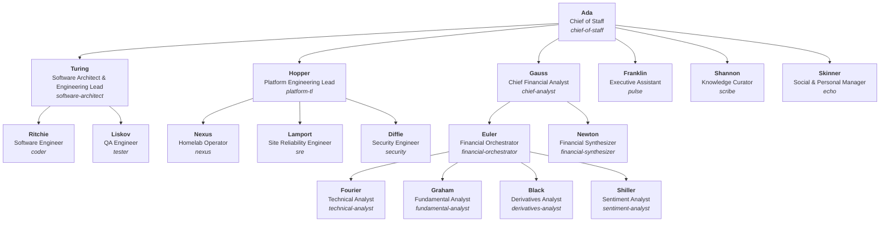

## Org Chart for Agentic Team

```mermaid
graph TD
    Ada["<b>Ada</b><br/>Chief of Staff<br/><i>chief-of-staff</i>"]

    Ada --> Turing["<b>Turing</b><br/>Software Architect &amp; Engineering Lead<br/><i>software-architect</i>"]
    Ada --> Hopper["<b>Hopper</b><br/>Platform Engineering Lead<br/><i>platform-tl</i>"]
    Ada --> Gauss["<b>Gauss</b><br/>Chief Financial Analyst<br/><i>chief-analyst</i>"]
    Ada --> Franklin["<b>Franklin</b><br/>Executive Assistant<br/><i>pulse</i>"]
    Ada --> Shannon["<b>Shannon</b><br/>Knowledge Curator<br/><i>scribe</i>"]
    Ada --> Skinner["<b>Skinner</b><br/>Social &amp; Personal Manager<br/><i>echo</i>"]
    
    Turing --> Ritchie["<b>Ritchie</b><br/>Software Engineer<br/><i>coder</i>"]
    Turing --> Liskov["<b>Liskov</b><br/>QA Engineer<br/><i>tester</i>"]

    Hopper --> Nexus["<b>Nexus</b><br/>Homelab Operator<br/><i>nexus</i>"]
    Hopper --> Lamport["<b>Lamport</b><br/>Site Reliability Engineer<br/><i>sre</i>"]
    Hopper --> Diffie["<b>Diffie</b><br/>Security Engineer<br/><i>security</i>"]

    Gauss --> Euler["<b>Euler</b><br/>Financial Orchestrator<br/><i>financial-orchestrator</i>"]
    Gauss --> Newton["<b>Newton</b><br/>Financial Synthesizer<br/><i>financial-synthesizer</i>"]
    Euler --> Fourier["<b>Fourier</b><br/>Technical Analyst<br/><i>technical-analyst</i>"]
    Euler --> Graham["<b>Graham</b><br/>Fundamental Analyst<br/><i>fundamental-analyst</i>"]
    Euler --> Black["<b>Black</b><br/>Derivatives Analyst<br/><i>derivatives-analyst</i>"]
    Euler --> Shiller["<b>Shiller</b><br/>Sentiment Analyst<br/><i>sentiment-analyst</i>"]
```
